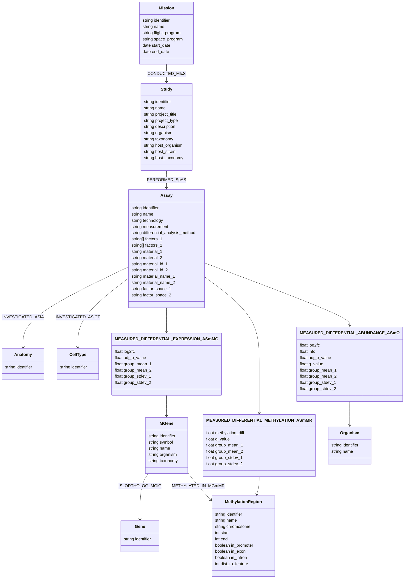

# Chat Transcript — SPOKE-GeneLab Knowledge Graph Overview

👤 **User**
@mcp-genelab: describe the spoke-genelab knowledge graph

---

🧠 **Assistant**

The SPOKE-GeneLab knowledge graph models NASA spaceflight omics data, connecting missions through to molecular measurements. Here's its structure.

## Node types

- **Mission** — spaceflight missions (flight/space program, start/end dates).
- **Study** — NASA Open Science Data Repository (OSDR) experiments (project title/type, host organism/strain, taxonomy).
- **Assay** — individual measurements within a study (technology, measurement type, differential analysis method, plus the two factor/material groups being compared).
- **MGene** — model-organism genes (ENTREZ ID, symbol, name, organism, taxonomy).
- **Gene** — reference genes by ENTREZ ID (ortholog targets).
- **MethylationRegion** — genomic base-pair ranges (chromosome, start/end, promoter/exon/intron overlap flags, distance to feature).
- **Organism** — taxa by NCBI taxonomy ID (used for microbial abundance).
- **Anatomy** — UBERON anatomical terms.
- **CellType** — Cell Ontology terms.

## Relationships

The biological hierarchy flows top-down:

- Mission **CONDUCTED** Study
- Study **PERFORMED** Assay
- Assay **INVESTIGATED** Anatomy / CellType (what tissue/cell was examined)

Assays carry the quantitative differential results as edge properties:

- Assay **MEASURED_DIFFERENTIAL_EXPRESSION** → MGene (log2fc, adj_p_value, group means/stdevs)
- Assay **MEASURED_DIFFERENTIAL_METHYLATION** → MethylationRegion (methylation_diff, q_value, group stats)
- Assay **MEASURED_DIFFERENTIAL_ABUNDANCE** → Organism (log2fc, lnfc, adj_p_value/q_value — fields vary by DESeq2 vs ANCOM-BC method)

And cross-links tie the molecular layer together:

- MGene **IS_ORTHOLOG** Gene (model organism → reference gene)
- MGene **METHYLATED_IN** MethylationRegion (couples expression to epigenetic regulation)

## What it's for

The graph supports three core analyses across spaceflight vs. ground-control conditions: differential gene expression, differential DNA methylation, and differential microbial abundance — plus the integrative "expression–methylation coupling" path (genes whose differential expression overlaps differentially methylated regions, i.e. classical epigenetic silencing).

Reasoning &amp; tool detail for this turn

This turn resolved the `@mcp-genelab` reference by loading the deferred tools, then queried node and relationship metadata to describe the graph from live schema rather than assumptions.

Tools called: `tool_search` (to load the mcp-genelab tools), `get_node_metadata`, `get_relationship_metadata`.

**Node metadata returned:** Anatomy (UBERON ID), Assay (identifier, name, technology, measurement, differential_analysis_method, factors_1/2, material_1/2, material_id_1/2, material_name_1/2, factor_space_1/2), CellType (Cell Ontology ID), Gene (ENTREZ ID), MGene (identifier, symbol, name, organism, taxonomy), MethylationRegion (identifier, name, chromosome, start, end, in_promoter, in_exon, in_intron, dist_to_feature), Mission (identifier, name, flight_program, space_program, start_date, end_date), Organism (NCBI taxonomy ID, name), Study (identifier, name, project_title, project_type, description, organism, taxonomy, host_organism, host_strain, host_taxonomy).

**Relationship metadata returned:**
- Assay -INVESTIGATED_ASiA-> Anatomy
- Assay -INVESTIGATED_ASiCT-> CellType
- Assay -MEASURED_DIFFERENTIAL_EXPRESSION_ASmMG-> MGene (log2fc, adj_p_value, group_mean_1/2, group_stdev_1/2)
- Assay -MEASURED_DIFFERENTIAL_METHYLATION_ASmMR-> MethylationRegion (methylation_diff, q_value, group_mean_1/2, group_stdev_1/2)
- Assay -MEASURED_DIFFERENTIAL_ABUNDANCE_ASmO-> Organism (log2fc, lnfc, adj_p_value, q_value, group_mean_1/2, group_stdev_1/2)
- MGene -IS_ORTHOLOG_MGiG-> Gene
- MGene -METHYLATED_IN_MGmMR-> MethylationRegion
- Mission -CONDUCTED_MIcS-> Study
- Study -PERFORMED_SpAS-> Assay

---

👤 **User**
@mcp-genelab: visualize schema

---

🧠 **Assistant**

Here's the SPOKE-GeneLab schema. Edges with properties (the three differential-measurement relationships) are shown as intermediary classes so their edge attributes are visible.

Saved as a `.mermaid` file.

Reasoning &amp; tool detail for this turn

Followed the `visualize_schema` workflow: built a draft Mermaid class diagram from the schema metadata, representing the three property-bearing edges as intermediary classes (rather than labeled arrows) so their edge attributes render. The draft was then passed through `clean_mermaid_diagram`, and only the cleaned output was used. The cleaned diagram was written to `~/Downloads/spoke-genelab-schema.mermaid` and shared with `present_files`.

Tools called: `visualize_schema` (workflow prompt), `clean_mermaid_diagram`, `bash_tool` (write file), `present_files`.

---

*Created by [mcp-genelab](https://github.com/sbl-sdsc/mcp-genelab) 0.5.0 on 2026-06-25*

Model: claude-opus-4-8
